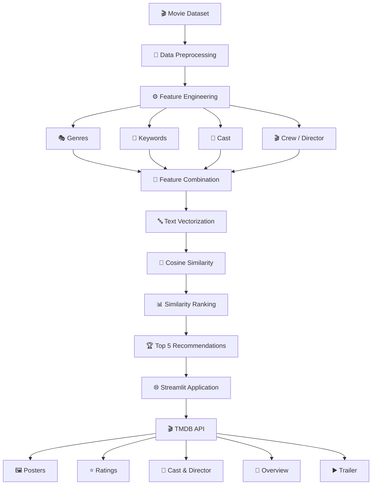
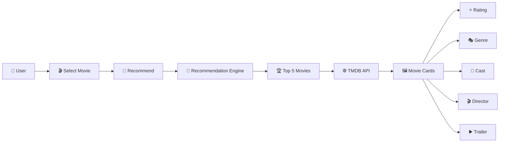
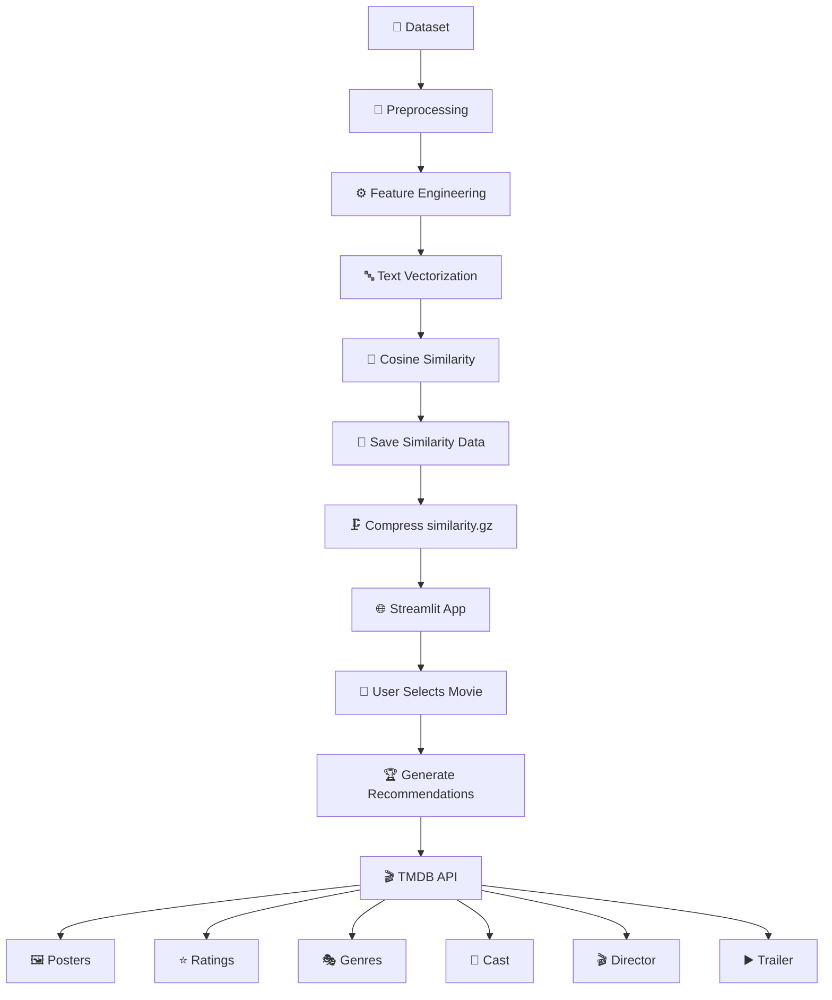
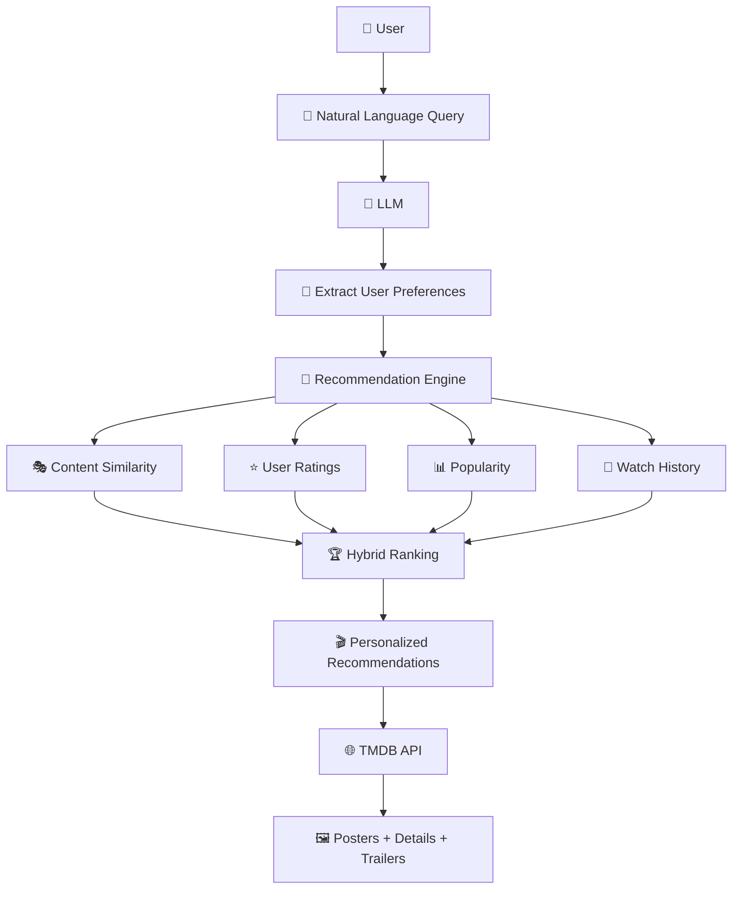

# 🎬 Movie Recommendation System

  
  
  
  
  

  <b>An end-to-end Machine Learning Movie Recommendation System</b>
   
  <i>Discover movies similar to your favorites using Content-Based Filtering.</i>

---

## 📌 Overview

The **Movie Recommendation System** is an end-to-end Machine Learning application that recommends movies based on the similarity of their content and metadata.

The system follows a **Content-Based Filtering** approach and uses important movie attributes such as:

- 🎭 Genres
- 🔑 Keywords
- 👥 Cast
- 🎬 Crew / Director

These features are processed and transformed into numerical representations. **Cosine Similarity** is then used to identify the most similar movies and generate the **Top 5 recommendations**.

The application is integrated with the **TMDB API** to provide rich movie information such as posters, ratings, genres, cast, director, release date, overview, and trailers.

---

# 🚀 Project Highlights

| Feature | Description |
|---|---|
| 🎯 Recommendation | Top 5 similar movies |
| 🧠 ML Approach | Content-Based Filtering |
| 📐 Similarity | Cosine Similarity |
| 🔤 NLP | Text feature processing |
| 🎬 Movie Data | TMDB API |
| 🖼️ Posters | Dynamic TMDB posters |
| ⭐ Ratings | TMDB movie ratings |
| 👥 Cast | Movie cast information |
| 🎥 Director | Director information |
| ▶️ Trailer | YouTube trailer integration |
| 🌐 Interface | Streamlit Web App |
| 🗜️ Optimization | Compressed similarity data |
| ☁️ Deployment | Streamlit Cloud |

---

# 🧠 How the Recommendation System Works

The recommendation engine follows a complete Machine Learning pipeline, starting from movie metadata preprocessing and ending with personalized movie recommendations.

---

# 🖥️ Streamlit Application

The trained recommendation model is integrated into an interactive **Streamlit web application**, allowing users to select a movie and instantly explore similar movies with detailed information.

## 🔄 User Flow

---

# 🛠️ Tech Stack

| Category | Technologies |
|---|---|
| 🐍 **Programming Language** | Python |
| 🐼 **Data Processing** | Pandas, NumPy |
| 🤖 **Machine Learning** | Scikit-learn |
| 🧠 **NLP / Text Processing** | Text Vectorization |
| 📐 **Recommendation Algorithm** | Cosine Similarity |
| 🎬 **Movie Data & API** | TMDB API |
| 🌐 **Web Framework** | Streamlit |
| 💾 **Model Serialization** | Pickle |
| 🗜️ **Data Compression** | Gzip |
| 🔧 **Version Control** | Git |
| 🐙 **Repository** | GitHub |
| ☁️ **Deployment** | Streamlit Cloud |

---

# 📊 End-to-End Workflow

The complete workflow combines the Machine Learning recommendation engine, optimized model storage, Streamlit interface, and TMDB API.

---

# ⚠️ Current Limitations

| Limitation | Description |
|---|---|
| 👤 **No User Personalization** | Recommendations are based on movie content and do not currently learn individual user preferences. |
| ⭐ **No User Rating History** | The system does not use personal ratings, likes, dislikes, or watch history. |
| 🤝 **Content-Based Only** | The current recommendation engine relies primarily on content similarity rather than collaborative filtering. |
| 🎬 **Metadata Dependency** | Recommendation quality depends on the availability and quality of genres, keywords, cast, and crew information. |
| 🌐 **TMDB API Dependency** | Posters, ratings, cast, trailers, and other movie details depend on TMDB API availability. |
| 📊 **Limited Ranking Signals** | Ranking is primarily based on content similarity and does not currently combine popularity, ratings, or user behavior. |
| 🆕 **Cold-Start for Preferences** | Since user history is not collected, the system cannot initially adapt recommendations to a specific user's taste. |
| 🔄 **Static Recommendation Model** | Similarity data is precomputed and does not continuously learn from new user interactions. |

---

# 🔮 Future Improvements

| Future Enhancement | Description |
|---|---|
| 🤝 **Hybrid Recommendation** | Combine Content-Based Filtering with Collaborative Filtering for better recommendations. |
| 👤 **Personalized Profiles** | Learn individual preferences from ratings, likes, dislikes, and watch history. |
| ⭐ **User Rating System** | Allow users to rate movies and use those ratings to improve recommendations. |
| ❤️ **Favorites & Watchlist** | Allow users to save movies for later viewing. |
| 🔍 **Advanced Search & Filters** | Filter movies by genre, rating, release year, language, popularity, and runtime. |
| 🤖 **LLM Integration** | Add natural-language movie recommendations through a conversational AI assistant. |
| 🧠 **Hybrid AI Ranking** | Combine similarity, popularity, ratings, and user preferences into a unified ranking system. |
| 📊 **Recommendation Analytics** | Add analytics for popular genres, recommendation frequency, and user preferences. |
| 🌎 **Multi-Language Support** | Extend movie discovery across multiple languages and regions. |
| 🔄 **Dynamic Learning** | Continuously update recommendations based on new user interactions. |

---

# 🚀 Future AI Architecture

A future version can evolve from a traditional content-based recommender into a more personalized **AI-powered recommendation platform**.

---

# 🎯 Key Takeaways

| Area | Implementation |
|---|---|
| 🧠 **Recommendation** | Content-Based Filtering |
| 📐 **Similarity** | Cosine Similarity |
| 🔤 **Text Processing** | NLP / Vectorization |
| 🎬 **Movie Information** | TMDB API |
| 🌐 **Application** | Streamlit |
| 🗜️ **Optimization** | Gzip Compression |
| ☁️ **Deployment** | Streamlit Cloud |

# 👩‍💻 Author

### **Anuska Biswas**

🎓 **Indian Institute of Technology (BHU), Varanasi**  
⚙️ **Mechanical Engineering Department**

---

  <b>🎬 Built with Python • Machine Learning • Streamlit • TMDB API</b>

